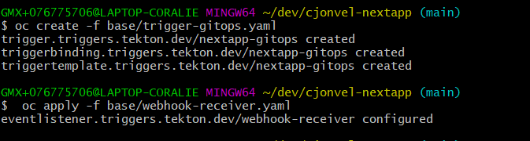
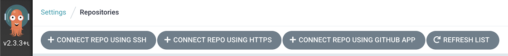

# Cloud Native CI/CD - GitOps Example

## Objective

The objective of this worked example is to show how to introduce GitOps in a CI/CD pipline. Instead of modifying the pipeline from the Tekton Lab you will create a new one and only modify the EventListener. Besides the pipeline you will also create a new configuration repository for the application where only the manifest files will reside. 


 
## Create the new configuration repository for the application

1. On GitHub create the repo using the UI, name it `<your-name>-nextapp-config`

    

1. Create a new directory **your-name-nextapp-config** in your workspace with a base folder in it 

    ```sh
    cd <workspace-dir>
    mkdir -p <your-name>-nextapp-config/base
    ```

1. Copy the manifest files from the `your-name-nextapp/k8s` directory

    ```sh
    cp <your-name>-nextapp/k8s/*.yaml <your-name>-nextapp-config/base/
    ```
    ```sh
    cd <your-name>-nextapp-config
    ```
1. Make the necessary changes to the manifest files

    For `base/kustomization.yaml` add in the file, at the end for example:

    ```yaml
    images:
    - name: image-name-placeholder
      newName: image-registry.openshift-image-registry.svc:5000/default/dummy:0.1
    ```

    and modify the commonLabels section
    
    ```yaml
    commonLabels:
    app: <your-name>-nextapp-gitops
    app.kubernetes.io/instance: <your-name>-nextapp-gitops
    app.kubernetes.io/name: <your-name>-nextapp-gitops
    ```
    

    Now, open the `base/deployment.yaml` file and change the image field from your image url to  `image-name-placeholder`
    
    ```yaml
    containers:
      - name: sample-app
        image: image-name-placeholder
    ```

1. Initialize the repository and push (don't forget to change **your-namme**)

    ```sh
    git init
    echo "# <your-name>-nextapp-config" >> README.md
    git add -A
    git commit -m "First commit"
    git remote add origin git@github.com:<your-name>/<your-name>-nextapp-config.git
    git branch -M main
    git push -u origin main
    ```

## Create new Pipeline artefacts

1. Ensure you are logged into your OpenShift cluster and go to your called **<ab-your-name**:

    ```
    oc project lab-<your-name>
    ```

1. Install the `git-cli` Task into your own project.

    ```sh
    tkn hub install task git-cli
    oc get task | grep git-cli
    ```
    

1. Go back into the `your-name-nextapp` project to create a new Pipeline that will fetch the manifest artifacts from the configuration repository.

    ```sh
    cd <workspace-dir>/<your-name>-nextapp
    ```
   
    Create the file `base/pipeline-gitops.yaml` with the following content and review the tasks. You will see that this pipeline does not deploy the application but update the manifests files with Kustomize then push those to the configuration repository.
   
    ```yaml
    apiVersion: tekton.dev/v1beta1
    kind: Pipeline
    metadata:
      name: nextapp-gitops
    spec:
      params:
        - name: IMAGE_NAME
          type: string
        - name: GIT_CODE_REPO
          type: string
        - name: GIT_CODE_REVISION
          type: string
        - name: GIT_CONFIG_REPO
          type: string
        - name: GIT_USER_NAME
          type: string
        - name: GIT_USER_EMAIL
          type: string
      workspaces:
        - name: pipeline-shared-data
        - name: github-credentials
      tasks:
        - name: fetch-code-repository
          taskRef:
            name: git-clone-v0-16-3
            kind: Task
          workspaces:
            - name: output
              workspace: pipeline-shared-data
          params:
            - name: url
              value: $(params.GIT_CODE_REPO)
            - name: revision
              value: $(params.GIT_CODE_REVISION)
            - name: subdirectory
              value: ""
            - name: deleteExisting
              value: "true"
    
        - name: build-push
          taskRef:
            name: buildah
            kind: ClusterTask
          runAfter:
            - fetch-code-repository
          workspaces:
            - name: source
              workspace: pipeline-shared-data
          params:
            - name: IMAGE
              value: $(params.IMAGE_NAME):$(tasks.fetch-code-repository.results.commit)
            - name: TLSVERIFY
              value: "false"
    
        - name: fetch-config-repository
          taskRef:
            name: git-clone-v0-16-3
            kind: Task
          runAfter:
            - build-push
          workspaces:
            - name: output
              workspace: pipeline-shared-data
          params:
            - name: url
              value: $(params.GIT_CONFIG_REPO)
            - name: revision
              value: main
            - name: deleteExisting
              value: "true"
    
        - name: update-manifests
          taskRef:
            name: openshift-client
            kind: ClusterTask
          runAfter:
            - fetch-config-repository
          workspaces:
            - name: manifest-dir
              workspace: pipeline-shared-data
          params:
          - name: SCRIPT
            value: |
              oc patch --type merge --local -o yaml -f /workspace/manifest-dir/base/kustomization.yaml \
                -p "images:
                      - name: image-name-placeholder
                        newName: $(params.IMAGE_NAME):$(tasks.fetch-code-repository.results.commit)" \
                > kustomization.yaml
                mv kustomization.yaml /workspace/manifest-dir/base/kustomization.yaml
              echo 'Patched kustomization.yaml'
    
        - name: commit-push
          taskRef:
            name: git-cli
            kind: Task
          runAfter:
            - update-manifests
          workspaces:
            - name: source
              workspace: pipeline-shared-data
            - name: ssh-directory
              workspace: github-credentials
          params:
          - name: GIT_USER_NAME
            value: $(params.GIT_USER_NAME)
          - name: GIT_USER_EMAIL
            value: $(params.GIT_USER_EMAIL)
          - name: GIT_SCRIPT
            value: |
              cp /root/.ssh/ssh-directory/ssh-privatekey /root/.ssh/id_rsa
              ssh-keyscan -t rsa github.com > /root/.ssh/known_hosts
              cd /workspace/source
              git checkout main
              git add base/kustomization.yaml
              git commit -m "Container image update"
              git push
    ```
   
    ```sh
    oc create -f base/pipeline-gitops.yaml
    ```

1. Create a new PipelineRun

    Create the file `pipelinerun-gitops.yaml`
   
    ```yaml
    apiVersion: tekton.dev/v1beta1
    kind: PipelineRun
    metadata:
      generateName: pipelinerun-nextapp-gitops-
    spec:
      serviceAccountName: pipeline
      params:
      - name: GIT_USER_NAME
        value: pipeline
      - name: GIT_USER_EMAIL
        value: pipeline@localhost
      - name: GIT_CODE_REPO
        value: git@github.com:<your-name>/<your-name>-nextapp.git   # to be changed
      - name: GIT_CODE_REVISION
        value: main
      - name: GIT_CONFIG_REPO
        value: git@github.com:<your-name>/<your-name>-nextapp-config.git    # to be changed
      - name: IMAGE_NAME
        value: de.icr.io/lab-registry/<your-name>-nextapp    # to be changed
      pipelineRef:
        name: nextapp-gitops
      workspaces:
      - name: pipeline-shared-data
        persistentVolumeClaim:
          claimName: nextapp-pipeline
      - name: github-credentials
        secret:
          secretName: github-credentials
    ```

1. Run the Pipeline and follow the logs

    ```sh
    oc create -f pipelinerun-gitops.yaml
    ```

    ```sh
    tkn pr logs -f -L
    ```
    
    The logs should end with something simular as below:
    
    

1. Still in the **your-name-nextapp** folder, create a new Trigger, TriggerBinding and TriggerTemplate

    Create file `base/trigger-gitops.yaml`
    
    ```yaml
    apiVersion: triggers.tekton.dev/v1alpha1
    kind: Trigger
    metadata:
      name: nextapp-gitops
    spec:
      serviceAccountName: pipeline
      bindings:
        - ref: nextapp-gitops
      template:
        ref: nextapp-gitops
    ---
    apiVersion: triggers.tekton.dev/v1alpha1
    kind: TriggerBinding
    metadata:
      name: nextapp-gitops
    spec:
      params:
      - name: git-repo-url
        value: $(body.repository.ssh_url)
      - name: git-repo-name
        value: $(body.repository.name)
      - name: git-revision
        value: $(body.head_commit.id)
    ---
    apiVersion: triggers.tekton.dev/v1alpha1
    kind: TriggerTemplate
    metadata:
      name: nextapp-gitops
    spec:
      params:
      - name: git-repo-url
        description: The git repository url
      - name: git-revision
        description: The git revision
        default: main
      resourcetemplates:
      - apiVersion: tekton.dev/v1beta1
        kind: PipelineRun
        metadata:
          generateName: nextapp-gitops-
        spec:
          serviceAccountName: pipeline
          pipelineRef:
            name: nextapp-gitops
          params:
          - name: GIT_CODE_REPO
            value: $(tt.params.git-repo-url)
          - name: GIT_CODE_REVISION
            value: $(tt.params.git-revision)
          - name: GIT_USER_NAME
            value: pipeline
          - name: GIT_USER_EMAIL
            value: pipeline@localhost
          - name: IMAGE_NAME
            value: de.icr.io/lab-registry/<your-name>-nextapp    # to be changed
          - name: GIT_CONFIG_REPO
            value: git@github.com:<your-name>/<your-name>-nextapp-config.git    # to be changed
          workspaces:
          - name: pipeline-shared-data
            persistentVolumeClaim:
              claimName: nextapp-pipeline
          - name: github-credentials
            secret:
              secretName: github-credentials
    ```
    
    ```sh
    oc create -f base/trigger-gitops.yaml
    ```

1. Change the EventListener in the `base/webhook-receiver.yaml`, so now when a git push is happening on GitHub it will trigger the `nextapp-gitops` pipeline rather than the one from the previous lab. You don't have to change anything on GitHub as we do not modify the EventListener nor its route, we are just changing what it triggers.

    Change the Triggers section to

    ```yaml 
        triggers:
          - bindings:
            - kind: TriggerBinding
              ref: nextapp-gitops
            template:
              ref: nextapp-gitops
    ```
    and apply it to your OpenShift cluster.
    ```sh
    $ oc apply -f base/webhook-receiver.yaml
    ```
    

1. Trigger a PipelineRun by pushing the application code to the repository and follow the logs   

    ```sh
    git add .
    git commit --allow-empty -m "Trigger PipelineRun"
    git push
    ```
    
    ```sh
    tkn pr logs -f -L
    ```
    Look for output simular to the one from step 4.

## Create the GitOps application

1. Delete the deployment that was done in the previous lab and its associated resources. There could be conflict on some fields that are immutable and cause the deployment to fail.
   ```sh
    oc delete deployment sample-app
    oc delete service sample-app
    oc delete route sample-app
    ```
     
1. To allow a namespace to be a deloyment target for Argo CD, it needs to be annotated. When the namespace has been created fot this lab for your user, the `argocd.argoproj.io/managed-by=openshift-gitops` annotation has been added to the **lab-your-name** project. Display your project properties to visualize it:

    ```sh
    oc get namespace -o yaml lab-<your-name>
    ```
    

     For information, the command to annotate is:
    ```sh
    oc label namespace lab-<your-name> argocd.argoproj.io/managed-by=openshift-gitops
    ```

1. From the OpenShift web console open the Argo CD UI

    

1. Click LOG IN VIA OPENSHIFT and then accept the permissions

    

1. Add the **your-name-nextapp-config** configuration repository 

    Navigate to Settings > Repositories

    

    Click `CONNECT REPO USING SSH`

    

    Fill out the form, use your ssh private key (from previous lab), check the `Skip server verification` box  and click `Connect` at the top of the window when all parameters are correct

    

1. Create the Argo CD Application

    

    Use the repository menu on the right and click `Create Application`, fill the following details:

    - application name : your-name-nextapp
    - project: default
    - repository URL: git@github.com:your-name/your-name-nextapp-config.git
    - path: ./base
    - Cluster: https://kubernetes.default.svc (this is the same cluster where ArgoCD is installed)
    - Namespace: lab-your-name
    
    Leave all the other values empty or with default selections. Finally click the `Create` button.

    

1. Click on the application tile, then click on `APP DIFF` button. You will see that Kustomization automatically happens, look at the `Service` resource, labels are set accordingly to what Kustomize defines, so the resource definition is different from what is saved in GitHub. Also ensure the image name in the deployment has been replaced.

    

1. Synchronize the application by clicking the `SYNC` button, select all resources at the bottom and then the `SYNCHRONIZE` button

    

    

    

## Push an application change to see the full CI/CD pipeline in action

1. Trigger a PipelineRun of your **your-name-nextapp** application and follow the logs

    ```sh
    git commit --allow-empty -m "Trigger PipelineRun"
    ```
    
    ```sh
    git push
    ```
    
    ```sh
    tkn pr logs -f -L
    ```

1. A new container image has been pushed to IBM Container Registry and the new name has been set in `kustomization.yaml` file so now the desired state set in the configuration repository is different from what is deployed in OpenShift. Switch to Argo CD UI, the application is OutOfSync, as expected. click the `APP DIFF` button and tick Compact diif to see the change.
   
    

1. Click the `SYNC` button then the `SYNCHRONIZE` button. Now the application is in `Sync Ok` state again.
   You can check in OpenShift console that the deployment now references on the latest image tag.
   


## END OF LAB
