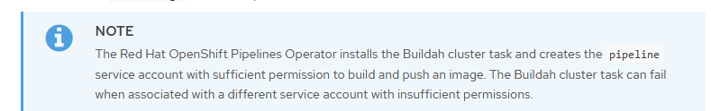
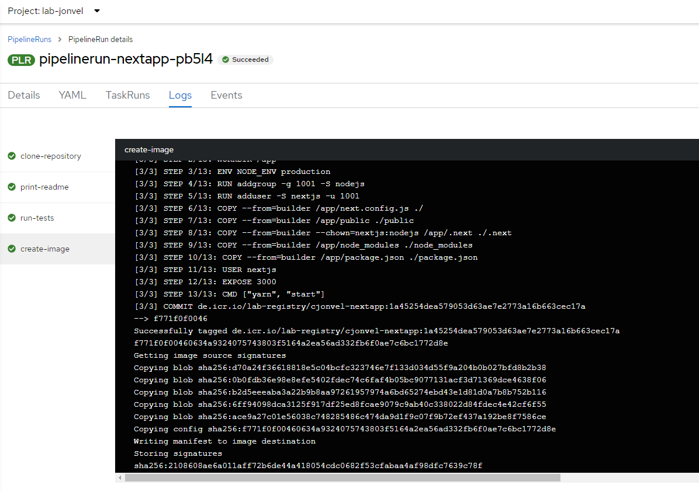
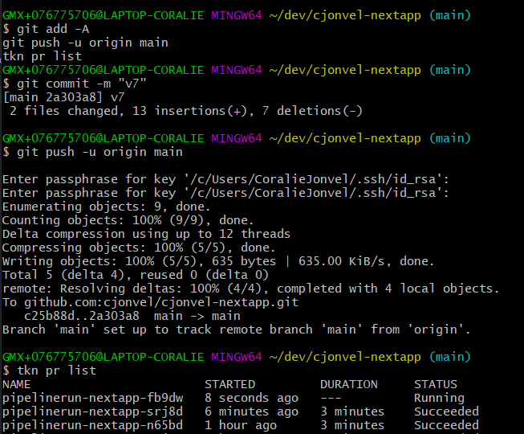

# Cloud Native CI/CD - Tekton Example


## Introduction

In this example, we are going to go thru a typical pipeline example using Tekton. Developers are commiting/pushing some code in a Git repository. This should normally trigger automatically a series of action (that I called an action chain) to clone, test, build and deploy to a Dev environment and then to a Prod environment.


Many have asked me "**why Tekton**", and "shall I use Tekton?" - well, it depends.

Tekton is Cloud Native as its core. It aims to be for pipeline (orchestration) what k8s is for container orchestration.

It also has a very small footprint. Its control plane can scale easily, and it provides scalable and concurrent execution of pipelines.

Its key tenants are **reusability, flexibility and interoperability.**

Tekton uses Tekton to create its own CI/CD workflows (which we call “dogfooding”) which means we have a production cluster always running Tekton, updated as soon as new releases are made. Companies like IBM and Puppet offer services based on Tekton. The IBM CD Service runs million of containers per month of customer Tekton pipelines.


## Prerequisites

- Any OpenShift Cluster (with version >= 4.6) with OpenShift Pipelines installed
- You should get access to that cluster with both CLI (oc) and Console mode from your laptop
- A valid account on [GitHub](https://github.com) and git CLI command installed (not github)
- A valid account on [IBM Cloud](https://cloud.ibm.com)


## Create your ssh keys for your GitHub account

1. **Generate ssh key on your laptop:**

  **IMPORTANT**: For Labs you will need a rsa ssh key, so please generate the following ssh key, without setting any passphrase:  
    In WSL, generate your key with the following command and note the path for the generated files:
    ```bash
    ssh-keygen -t rsa -b 4096 -C "your_email@example.com"
    ```
  
   When prompted for password, just type enter to leave it blank.
     In case this does not work please refer to full instructions on: 
  https://docs.github.com/en/enterprise-server@3.1/authentication/connecting-to-github-with-ssh/generating-a-new-ssh-key-and-adding-it-to-the-ssh-agent 
  
2. **Add it to your IBM GitHub account:**
 Please follow the screens on:
  https://docs.github.com/en/enterprise-server@3.1/authentication/connecting-to-github-with-ssh/generating-a-new-ssh-key-and-adding-it-to-the-ssh-agent#adding-your-ssh-key-to-the-ssh-agent
  
3. **Add your SSK key to the ssh-agent:**
  Start the ssh agent locally and add your ssh private key to it:
  ```bash
  $ eval "$(ssh-agent -s)"
  > Agent pid 59566
  $ ssh-add  ~/.ssh/id_rsa
  ```
  In case this does not work please refer to full instructions on: 
   https://docs.github.com/en/enterprise-server@3.1/authentication/connecting-to-github-with-ssh/generating-a-new-ssh-key-and-adding-it-to-the-ssh-agent#adding-your-ssh-key-to-the-ssh-agent
  
4. **Test your connection**
  You can test your connection with (don't change the git prefix, do not replace it with your username):
  ```bash
  $ ssh -T git@github.com
  ```
  Reference: https://docs.github.com/en/enterprise-server@3.1/authentication/connecting-to-github-with-ssh/testing-your-ssh-connection
  

## Connect to OpenShift Cluster


**Connection to OpenShift Cluster has already been done in the previous labs. Reconnect if you have have been disconnected**

We suppose that we already have this cluster pr follow instructions on [IBM Cloud setup](/ibmcloud.md#access-acme-account)

Connect to the OpenShift console and then ask the token by using the **Copy Login Command**


Display the token:


Copy the oc command (example below) :

```
oc login --token=sha256~2AwLLR0Rc83JLfavWNPHjeEp6y7I4dqJbxsbDiAtWQE --server=https://c100-e.us-east.containers.cloud.ibm.com:30720
```

Results:


## Review installed OpenShift Pipelines


**On the cluster you have accessed to, OpenShift Pipelines are already configured.**

On the OpenShift console Administrator pane, go to Operators > Installed Operators and review the installed operators.


**You can read this section for information on installation steps or go directly to next step 'Install tekton command line tool'**

If OpenShift Pipelines are not installed on your cluster, here are the instuctions to install.
On the Administrator pane, go to Operators > OperatorHub  and then filter on `pipelines` and click on **Red Hat OpenShift Pipelines**


Then click on Install at the top:


Click on Install again:


It will take a few seconds to start:


If you click again on View Operator, then you will see the following page:


Click again on the Pipelines Operator to see the following:


** End of optional section **


## Install tekton command line tool

On the OpenShift console Administrator pane, go to Operators > Installed Operators  and then filter on `pipelines` and click on **Red Hat OpenShift Pipelines**


Browse:


Follow one of the links (`Download tkn for xxx`) corresponding to your Operating System.

Untar and then copy the tkn file into a binary file that is already in the path. Test the **tkn** command


## GitHub Repository Creation


**Create a new private repository on your own account on github.com**

1. First we will download the source code from an existing sample repository, we will not fork it as it will result in a **public** repository and we want to practice access to a secure repository in this lab. Open [nextapp sample repository](https://github.com/cjonvel/nextapp) and download a archive of the source code from the green `code` button.


2. Create a new **your-name-nextapp** repository in 

Use default **Private** type and click **create repository**


3. **Copy source code:** go on your local machine in your workspace, create the **your-name-nextapp** directory and unzip all the files from the download nextapp zip file.

4. Proceed to initialization as suggested on the, add all the local files (be sure to be in the **your-name-nextapp** directory)

```
cd cjonvel-nextapp
git init
git add -A
git commit -m "first commit"
git branch -M main
git remote add origin git@github.com:cjonvel/cjonvel-nextapp.git
git push -u origin main
``` 

Check that everything is fine  (be sure you are in the **your-name-nextapp** directory)

```
git status
```


Your repository is now ready for the next step.


## Task#1 Clone


Now that we have created a remote repository, the first task in the pipeline will be the cloning of that repo inside the OpenShift cluster. And more specifically into a workspace on a persistent volume.

For a CI pipeline to work, it first needs to acquire its main input: the codebase that you want to build and deploy. In this first version of the pipeline, you will have two Tasks:

1. clone the source repository - and for that task, we use the `git-clone` tekton task.
2. run `cat README.md` as confirmation that `git-clone` (and the workspace) are functioning as intended


By default `git-clone` is provided as a `ClusterTask` on your cluster:

```
oc get clustertasks | grep -i git-clone
```


But for this lab, we will use an older version of git-clone as the latest one requires more configuration to run as non-root user. We will use the the `git-clone-v0-16-3` task provided in a directory called  `base`. We are going to store all the artifacts concerning ci/cd into this directory.
Now switch to the project that has been assigned to your user (which should be called **lab-your-name**) and create the `git-clone-v0-16-3` Task:

```
oc project lab-jonvel
oc apply -f base/git-clone-v0-16-3-Task.yaml
```


Have a look at the [`git-clone` documentation](https://github.ibm.com/tektoncd/catalog/tree/main/task/git-clone/0.3) and you will notice that the least amount of data you may provide to the `git-clone` task is a workspace and URL of the Git repository to clone.

We are going to store the pipeline definitions (and the tasks and the steps) in a file called **pipeline.yaml** in the `base` directory, create this file and edit it with the editor of your choice.

Here is the pipeline first definition:

```yaml
apiVersion: tekton.dev/v1beta1
kind: Pipeline
metadata:
  name: pipeline-nextapp
spec:
  params:
    - name: source-repo
      type: string
      description: Source code repository
  tasks:
    - name: clone-repository
      params:
        - name: url
          value: "$(params.source-repo)"
      taskRef:
        name: git-clone-v0-16-3
        kind: Task
      workspaces:
        - name: output
          workspace: pipeline-shared-data
  workspaces:
    - name: pipeline-shared-data

```


A repository can be shared between build steps if you use a [`PersistentVolume`](https://kubernetes.io/docs/concepts/storage/persistent-volumes/). This introduces [Kubernetes storage](https://kubernetes.io/docs/concepts/storage/). For your use case in this course, the easiest approach is to create a [`PersistentVolumeClaim` (PVC)](https://kubernetes.io/docs/concepts/storage/persistent-volumes/#persistentvolumeclaims) which will manage the `PersistentVolume` binding process for you.

 
Create a file called **pipeline-pvc.yaml** in the `base` directory and edit it to set this content

```yaml
apiVersion: v1
kind: PersistentVolumeClaim
metadata:
  name: nextapp-pipeline
spec:
  accessModes:
    - ReadWriteOnce
  volumeMode: Filesystem
  resources:
    requests:
      storage: 1Gi
```

Create the Persistent Volume in the OpenShift cluster with 
```
oc create -f base/pipeline-pvc.yaml
```

The `PersistentVolume` will be automatically created using the default `StorageClsas`.
Monitor the `PersistentVolumeClaim` creation, it will be in a `Pending` state for some time .

```
$ oc get pvc
NAME                STATUS    VOLUME                                     CAPACITY   ACCESS MODES   STORAGECLASS      AGE
nextapp-pipeline    Pending                                                                        ibmc-block-gold   9s
```

Wait for the pvc to be in `Bound` state.

```
$ oc get pvc
NAME                STATUS   VOLUME                                     CAPACITY   ACCESS MODES   STORAGECLASS      AGE
nextapp-pipeline    Bound    pvc-041e2191-c507-4895-9bd6-e7fc3ce306aa   20Gi       RWO            ibmc-block-gold   3m13s
```

One important detail about Tekton is that a `Pipeline` will expect its `PipelineRun` to provide the workspaces and Volume bindings. Similar to `TaskRun`, you will use a generated name and `oc create -f <file-name>.yaml` with a separate `PipelineRun` file.

Now create a new file called `pipelinerun.yaml` in the **nextapp directory** (not in the base sub-directory -- we will see why later).

Copy this content in the file (**change to your github account**)

```yaml
apiVersion: tekton.dev/v1beta1
kind: PipelineRun
metadata:
  generateName: pipelinerun-nextapp-
spec:
  params:
    - name: source-repo
      value: git@github.com:cjonvel/your-name-nextapp.git
  pipelineRef:
    name: pipeline-nextapp
  workspaces:
    - name: pipeline-shared-data
      persistentVolumeClaim:
        claimName: nextapp-pipeline # this PVC must already exist

```

In this case you use a [`volumeClaimTemplate`](https://kubernetes.io/docs/concepts/storage/persistent-volumes/) to ask the cluster for enough resources for your PipelineRun.


Now let's create the **pipeline** and the **pipelinerun**

```
oc apply -f base/pipeline.yaml
oc create -f pipelinerun.yaml
```


Check the logs using the generated pipeline id and don't panic is there is an error, this is the expected outcome for now:

```
tkn pr logs pipelinerun-nextapp-t77mg
```


You can notice that the clone failed because of access rights to the repository, you need authentication before cloning the repository.

To store you password on the cluster you will use a Kubernetes `Secret`. "A Secret is an object that contains a small amount of sensitive data such as a password, a token, or a key." ([source](https://kubernetes.io/docs/concepts/configuration/secret/)).
Tekton supports authentication to git via the Kubernetes first-class Secret types `basic-auth` and `ssh-auth` ([source](https://tekton.dev/docs/pipelines/auth/#configuring-basic-auth-authentication-for-git)).
You will use a `ssh-auth` secret to autenticate to `github.com` only.

```shell
oc create secret generic github-credentials --from-file=ssh-privatekey=<path/to/ssh/private/key> --type=kubernetes.io/ssh-auth
oc annotate secret github-credentials \
  "tekton.dev/git-0=github.com"  
```


To be able to use a secret in a `PipelineRun`, you need to run the pipeline under a specific `ServiceAccount`. 
When installing the pipelines Operator it automatically creates the **pipeline** service account that will have the correct rights to run pipelines as well as some specific rights for image creation and access to registry.



Link the secret to the existing pipeline service account and check the result (should be the last line):
```shell
oc secrets link pipeline github-credentials
oc get sa pipeline -o yaml
```


Then add `pipeline` service account, at the start of the spec section in the `pipelinerun.yaml` file:

```yaml
apiVersion: tekton.dev/v1beta1
kind: PipelineRun
metadata:
  generateName: pipelinerun-nextapp-
spec:
  serviceAccountName: pipeline
  params:
    - name: source-repo
      value: git@github.com:cjonvel/cjonvel-nextapp.git
  pipelineRef:
    name: pipeline-nextapp
  workspaces:
    - name: pipeline-shared-data
      volumeClaimTemplate:
        spec:
          resources:
            requests:
              storage: 1Gi
          accessModes:
            - ReadWriteOnce
```
Run the pipeline again

```shell
oc create -f pipelinerun.yaml
```

And check the logs:

```
tkn pr logs pipelinerun-nextapp-mcd57
```

At this point, if you run the Pipeline, the git-clone task should succeed:


Finally, your goal is to run `cat README.md` to confirm that you are sharing data between Tasks (Pods) in your Pipeline.

Now you will define a new task named `print-readme`, then add a `print-readme` step to your pipeline inside of `nodejs.Pipeline.yaml`:

Create the file **base/print-readme.yaml** and add the following content:

```yaml
apiVersion: tekton.dev/v1beta1
kind: Task
metadata:
  name: print-readme
spec:
  steps:
    - name: print
      image: quay.io/ibmgaragecloud/alpine-curl
      script: |
        cat /workspace/dir-with-readme/README.md
  workspaces:
    - name: dir-with-readme

```


And then we have to modify the pipeline to add that task:

```yaml
apiVersion: tekton.dev/v1beta1
kind: Pipeline
metadata:
  name: pipeline-nextapp
spec:
  params:
    - name: source-repo
      type: string
      description: Source code repository
  workspaces:
    - name: pipeline-shared-data
  tasks:
    - name: clone-repository
      params:
        - name: url
          value: "$(params.source-repo)"
      taskRef:
        name: git-clone-v0-16-3
        kind: Task
      workspaces:
        - name: output
          workspace: pipeline-shared-data
    - name: print-readme
      runAfter:
        - clone-repository
      taskRef:
        name: print-readme
        kind: Task
      workspaces:
        - name: dir-with-readme
          workspace: pipeline-shared-data
  workspaces:
    - name: pipeline-shared-data
```

This final YAML shows three important concepts:

1. using an existing `Task` from the Tekton Catalog
2. writing a custom `Task`
3. starting with a clean build folder and sharing files across tasks by using a `volumeClaimTemplate`. (A `PersistentVolumeClaim` would have used the same persistent volume for every pipeline run rather than a new volume for each pipeline run.)

Now do the following:

```
oc apply -f base/
oc create -f pipelinerun.yaml
```

After some time, the 2 tasks will appear:


You can also look at the OpenShift Console:


It took around **2 minutes** to copy the repo into the openshift cluster storage.


## TASK#2 CI Tests


One of the most important steps in a Continuous Integration (CI) pipeline is running the tests. Since your application uses Node, you will use the `npm install-ci-test` command to validate that the current code does not introduce test failures.

This requires another task/step after cloning the repository:

1. `npm install-ci-test` - run a clean installation of the project dependencies, then run all the tests.

You can look at the Tekton hub to check the npm definitions:

```
https://hub.tekton.dev
```


Search `npm` in the tekton catalog:


You must also first check if the `npm` is part of the cluster tasks or the tasks in OpenShift:

```
oc get clustertasks | grep npm
oc get task | grep npm
```


If you get no answers from both queries then decide to add a new task.

You can install the task using `kubectl` or `oc`. Be sure to be in your project.

```
oc project lab-jonvel
oc apply -f https://raw.githubusercontent.com/tektoncd/catalog/main/task/npm/0.1/npm.yaml
```


Then list the taks to search the npm:

```
oc get task | grep npm
npm                 42s
```


Or you can also use the tkn CLI:

```
tkn tasks list
tkn task describe npm
```


Next add a `run-tests` task/step to your pipeline:

```yaml
apiVersion: tekton.dev/v1beta1
kind: Pipeline
metadata:
  name: pipeline-nextapp
spec:
  # ... Omitted for brevity
  tasks:
    # ... Omitted for brevity
    - name: run-tests
      params:
        - name: ARGS
          value:
            - install-ci-test
      runAfter:
        - print-readme
      taskRef:
        name: npm
      workspaces:
        - name: source
          workspace: pipeline-shared-data
  workspaces:
    - name: pipeline-shared-data
```


Here is the changed `pipeline.yaml` file that you can copy/paste to your file:

```yaml
apiVersion: tekton.dev/v1beta1
kind: Pipeline
metadata:
  name: pipeline-nextapp
spec:
  params:
    - name: source-repo
      type: string
      description: Source code repository
  tasks:
    - name: clone-repository
      params:
        - name: url
          value: "$(params.source-repo)"
      taskRef:
        name: git-clone-v0-16-3
        kind: Task
      workspaces:
        - name: output
          workspace: pipeline-shared-data
    - name: print-readme
      runAfter:
        - clone-repository
      taskRef:
        name: print-readme
        kind: Task
      workspaces:
        - name: dir-with-readme
          workspace: pipeline-shared-data
    - name: run-tests
      params:
        - name: ARGS
          value:
            - install-ci-test
      runAfter:
        - print-readme
      taskRef:
        name: npm
      workspaces:
        - name: source
          workspace: pipeline-shared-data
  workspaces:
    - name: pipeline-shared-data
```


Now do the following:

```
oc apply -f base/
oc create -f pipelinerun.yaml
```


You can check the logs with the  `tkn pr logs` command to observe the progress of the pipeline in the terminal. You can also see the `PipelineRun` and its progress in the OpenShift console. Open the OpenShift console by running `oc console` in the terminal.

Both steps in the pipeline should run sequentially and complete successfully.
 


## TASK#3 Build & Push to IBM Container Registry


Now that we have copied and tests the source code, we can use it to build your application and the container.

[`buildah`](https://github.ibm.com/containers/buildah) is tool for building Open Container Initiative (OCI) containers. buildah, for your case, will use a [Dockerfile to build a container](https://github.ibm.com/containers/buildah/blob/master/docs/tutorials/01-intro.md#using-dockerfiles-with-buildah).

`buildah` has been configured as a `ClusterTask` on your cluster:

```
oc get clustertasks | grep -i buildah
```


You see several versions.

It is important to note that for this training, you need to use the `0.1` release of the buildah Tekton Task since the `0.2` version is incompatible with OpenShift Container Platform `4.6` or greater.

Look at the documentation here: https://github.com/tektoncd/catalog/tree/main/task/buildah/0.1


You will use IBM Cloud Container Registry as the image repository. To familiarize with IBM Cloud registry, feel free to read https://cloud.ibm.com/docs/Registry?topic=Registry-registry_overview.

1. For the next steps, you need to use `ibmcloud` command line interface; either use it in the IBM Cloud Shell interface available in IBM Cloud or use the `ibmcloud` CLI plugin on your computer. The easiest way is to use the Cloud Shell console.

On IBM Cloud, click this icon to initiate the session. It can take 1 or 2 minutes to initialize.


In your session, make sure that ibmcloud cli and its plugins are up-to-date.
```
ibmcloud plugin list
```
 
 

2. Optional: If you are on your computer, you will need to login to IBM Cloud and select the **ACME** account on which you'll create a registry namespace. You could also use your own private account on which you should have the appopriate rights.
```
ibmcloud login --sso   
```

3. Check the current settings with:
```
ibmcloud target 
```


If you are not on the Franfkufrt region, run
```
ibmcloud target -r eu-de
```

4. Container images are stored in namespaces, a namespace has been created for you and you have the appropriate IAM rights to push and pull images to/from it. (Reference https://cloud.ibm.com/docs/Registry?topic=Registry-iam#access_roles_configure)
```
ibmcloud cr namespace-list  -v
```


5. To build the image for this specific application, we need the appropriate **Dockerfile** in the the repository that contains the instructions to build the container image.


Create the `Dockefile` file and add these lines:

```
FROM quay.io/upslopeio/node-alpine AS deps
RUN apk add --no-cache libc6-compat
WORKDIR /app
COPY package.json ./
RUN yarn install --frozen-lockfile

# Rebuild the source code only when needed
FROM quay.io/upslopeio/node-alpine AS builder
WORKDIR /app
COPY . .
COPY --from=deps /app/node_modules ./node_modules
RUN yarn build && yarn install --production --ignore-scripts --prefer-offline

# Production image, copy all the files and run next
FROM quay.io/upslopeio/node-alpine AS runner
WORKDIR /app

ENV NODE_ENV production

RUN addgroup -g 1001 -S nodejs
RUN adduser -S nextjs -u 1001

COPY --from=builder /app/next.config.js ./
COPY --from=builder /app/public ./public
COPY --from=builder --chown=nextjs:nodejs /app/.next ./.next
COPY --from=builder /app/node_modules ./node_modules
COPY --from=builder /app/package.json ./package.json

USER nextjs
EXPOSE 3000
CMD ["yarn", "start"]
``` 


6. Remember that the pipelines work with the source code pulled from github so you need to push the local changes to git so that the Dockerfile will be visible to the pipeline:
```
git add -A
git commit -m "added Dockerfile"
git push -u origin main
``` 


7. Going back to the pipeline, we need a new parameter for the `buildah` task to set the  **image name and repository** that points to IBM Container Registry and namespace validated previously. The new parameter for the pipelinerun and also in the pipeline definition will be like this:

```yaml
    - name: image-registry
      value: de.icr.io/lab-registry/<your-name>-nextapp
```

Here is the new version of **pipeline.yaml** file with the `create-image` task and the `image-registry` parameter.

```yaml
apiVersion: tekton.dev/v1beta1
kind: Pipeline
metadata:
  name: pipeline-nextapp
spec:
  params:
    - name: source-repo
      type: string
      description: Source code repository
    - name: image-registry
      type: string
      description: Docker image repository
  tasks:
    - name: clone-repository
      params:
        - name: url
          value: "$(params.source-repo)"
      taskRef:
        name: git-clone-v0-16-3
        kind: Task
      workspaces:
        - name: output  
          workspace: pipeline-shared-data
    - name: print-readme
      runAfter:
        - clone-repository
      taskRef:
        name: print-readme
        kind: Task
      workspaces:
        - name: dir-with-readme
          workspace: pipeline-shared-data
    - name: run-tests
      params:
        - name: ARGS
          value:
            - install-ci-test
      runAfter:
        - print-readme
      taskRef:
        name: npm
      workspaces:
        - name: source
          workspace: pipeline-shared-data
    - name: create-image
      params:
        - name: IMAGE
          value: "$(params.image-registry):$(tasks.clone-repository.results.commit)"
        - name: TLSVERIFY
          value: "false"
      runAfter:
        - run-tests
      taskRef:
        name: buildah
        kind: ClusterTask
      workspaces:
        - name: source
          workspace: pipeline-shared-data
  workspaces:
    - name: pipeline-shared-data

```


8. The task will also need to provide authentication to IBM Container Registry. This will be done, like for git, with a OpenShift `Secret` that will reference your IBM Cloud API Key. IF you do not have yet an API Key, go to IBM Cloud console and on the right go to **Manage > Access (IAM).** , or follow complete instructions at  [IBM Cloud API key creation](/ibmcloud.md#access-ibm-cloud-api-key)

Let's create a secret to provide to the pipeline the credentials to connect to our registry
```
oc create secret docker-registry ibmcloud-cr-credentials \
    --docker-username=iamapikey \
    --docker-password=<your-ibm-cloud-api-key> \
    --docker-server=de.icr.io \
    --namespace=lab-<your-name>
```

9. Add this secret to the existing `pipeline` Service Account and check that is correctly added by displaying its content:
```
oc secrets link pipeline ibmcloud-cr-credentials
oc get sa pipeline -o yaml
```
 
10. Update the `pipelinerun.yaml` to provide the right data to the pipeline
```yaml
apiVersion: tekton.dev/v1beta1
kind: PipelineRun
metadata:
  generateName: pipelinerun-nextapp-
spec:
  serviceAccountName: pipeline
  params:
    - name: source-repo
      value: git@github.com:<your-name>/<your-name>-nextapp.git 
    - name: image-registry
      value: de.icr.io/lab-registry/<your-name>-nextapp  
  pipelineRef:
    name: pipeline-nextapp
  workspaces:
    - name: pipeline-shared-data
      volumeClaimTemplate:
        spec:
          resources:
            requests:
              storage: 1Gi
          accessModes:
            - ReadWriteOnce
```

21. Deploy the new pipeline on the cluster and create a new 'pipeline run'
```
oc apply -f base/pipeline.yaml
oc create -f base/pipelinerun.yaml
```

22. Monitor the execution of the pipelinerun 



and when successfully completed then check in your registry namespace that a new version of the image has been built.

```
ibmcloud cr image-list
``` 


## TASK#4 Manifests


After pushing the image into a registry, it is also necessary to prepare some Kubernetes resources (yaml files).

Next, we will use [Kustomize](https://kustomize.io/) to build your Kubernetes configuration. Kustomize is a tool for customizing Kubernetes YAML configuration files.

For this, we are going to create a new directory **k8s** and then populate this directory with some files.

```
mkdir k8s
```

Create in k8s, **deployment.yaml**, don't try to change the image name or url, this will be the role of the task to override it.

```yaml
apiVersion: apps/v1
kind: Deployment
metadata:
  name: sample-app
spec:
  replicas: 1
  selector:
    matchLabels:
      app.kubernetes.io/instance: app-instance
      app.kubernetes.io/name: app
  template:
    metadata:
      labels:
        app.kubernetes.io/instance: app-instance
        app.kubernetes.io/name: app
    spec:
      restartPolicy: Always
      terminationGracePeriodSeconds: 30
      dnsPolicy: ClusterFirst
      schedulerName: default-scheduler
      containers:
      - name: sample-app
        image: quay.io/astalavista/sample-app:d90c742ee626048c4d1e2032eb836255e4036561
        ports:
        - name: http
          protocol: TCP
          containerPort: 3000
        env:
        - name: INGRESS_HOST
        - name: PROTOCOLS
        - name: LOG_LEVEL
          value: debug
        resources: {}
        livenessProbe:
          failureThreshold: 3
          httpGet:
            port: 3000
            path: /
            scheme: HTTP
          periodSeconds: 10
          successThreshold: 1
          timeoutSeconds: 1
        readinessProbe:
          failureThreshold: 3
          httpGet:
            port: http
            path: /
            scheme: HTTP
          periodSeconds: 10
          successThreshold: 1
          timeoutSeconds: 1
        terminationMessagePath: /dev/termination-log
        terminationMessagePolicy: File
        imagePullPolicy: IfNotPresent
      securityContext: {}
  revisionHistoryLimit: 10
  progressDeadlineSeconds: 600
```

The content for **service.yaml**

```yaml
apiVersion: v1
kind: Service
metadata:
  name: sample-app
spec:
  type: ClusterIP
  selector:
    app.kubernetes.io/instance: app-instance
    app.kubernetes.io/name: app
  ports:
  - name: http
    protocol: TCP
    port: 80
    targetPort: 3000
  sessionAffinity: None
```

The content for **route.yaml**

```yaml
apiVersion: route.openshift.io/v1
kind: Route
metadata:
  name: sample-app
spec:
  tls:
    termination: edge
  to:
    name: sample-app
    kind: Service
    weight: 100
  wildcardPolicy: None
```

And finally for **kustomization.yaml**

```yaml
apiVersion: kustomize.config.k8s.io/v1beta1
kind: Kustomization
resources:
  - deployment.yaml
  - service.yaml
  - route.yaml
commonLabels:
  app: nextapp
  app.kubernetes.io/instance: nextapp
  app.kubernetes.io/name: nextapp
```


Open `deployment.yaml` and notice the labels in the `spec.template.metadata.labels` field.

Then, open `service.yaml` and notice that matching labels are specified in the `spec.selector` field. A Service is an abstract way to expose an application running on a set of Pods as a network service. The set of Pods targeted by a Service is usually determined by specifying matching labels in the selector. The Service targets any Pod with labels that match the selector.

While you won't have time to learn all about [Kubernetes Labels and Selectors](https://kubernetes.io/docs/concepts/overview/working-with-objects/labels/) you will need them for the Service to target the correct pods and for the OpenShift Developer Perspective Topology View to display links to a specific commit in your GitHub repository.

> You might want to review the [Common labels](https://kubernetes.io/docs/concepts/overview/working-with-objects/common-labels/) used in Kubernetes.


Since there is **no Tekton Catalog task for Kustomize**, you will construct your own Task, doing the development for this locally will help you get a better understanding of Kustomize.

Next, define a custom Tekton Task in `base/manifest.yaml`:

```yaml
apiVersion: tekton.dev/v1beta1
kind: Task
metadata:
  name: manifest
spec:
  params:
    - name: app-name
      description: the name of the app
    - name: commit
      description: The precise commit SHA used for this task
    - name: image-registry
      description: contains the full image repository (without :tag)
    - name: source-repo
      description: Source git repository
  results:
    - name: manifest
      description: The path to the yaml file
  steps:
    - name: create-manifest
      image: quay.io/upslopeio/kustomize:latest
      script: |
        #!/bin/sh
        set -e

        trap 'catch $? $LINENO' EXIT

        catch() {
          if [ "$1" != "0" ]; then
            echo "Error $1 occurred on $2"
          fi
        }

        cd /workspace/source/k8s

        if [ -f kustomization.yaml ] || [ -f kustomization.yml ] || [ -f Kustomization ]; then
          echo "Kustomization file found."
        else
          echo "Error: unable to find one of 'kustomization.yaml', 'kustomization.yml' or 'Kustomization' in folder:"
          pwd
          exit 1
        fi

        kustomize edit set image "*=$(params.image-registry):$(params.commit)"
        kustomize edit set label "app:$(params.app-name)"
        kustomize edit set label "app.kubernetes.io/instance:$(params.app-name)"
        kustomize edit set label "app.kubernetes.io/name:$(params.app-name)"
        kustomize edit add annotation "app.openshift.io/vcs-uri:$(params.source-repo)"
        kustomize edit add annotation "app.openshift.io/vcs-ref:$(params.commit)"
        kustomize build > manifest.yaml

        if [ -f manifest.yaml ]; then
          echo "manifests.yaml successfully generated"
          echo "contents of manifests is:"
          cat manifest.yaml
        else
          echo "ERROR: manifest.yaml not generated"
          exit 1
        fi
    - name: manifest-to-results
      image: quay.io/upslopeio/kustomize:latest
      script: |
        echo -n "k8s/manifest.yaml" > $(results.manifest.path)
  workspaces:
    - name: source
      description: contains the cloned git repo
```


Then modify the **pipeline.yaml** by adding a new parameter `app-name` and a new task `manifest` at the end of it:

```yaml
# ...omitted
  params:
    - name: app-name
      type: string
      description: Application name
# ...omitted
    - name: manifest
      params:
        - name: app-name
          value: "$(params.app-name)"
        - name: source-repo
          value: "$(params.source-repo)"
        - name: commit
          value: "$(tasks.clone-repository.results.commit)"
        - name: image-registry
          value: "$(params.image-registry)"
      runAfter:
        - create-image
      taskRef:
        name: manifest
      workspaces:
        - name: source
          workspace: pipeline-shared-data
  workspaces:
    - name: pipeline-shared-data
```

Adding the new `manifest` task to the pipeline involved adding a new parameter `app-name`. You need to provide a value for this new parameter in the **pipelinerun.yaml**:

```yaml
apiVersion: tekton.dev/v1beta1
kind: PipelineRun
metadata:
  generateName: pipelinerun-nextapp-
spec:
  serviceAccountName: pipeline
  params:
    - name: app-name
      value: nextapp
    - name: source-repo
      value:  git@github.ibm.com:emea-ce-cloud-native-boot-camp-cohort-[X]/<your-name>-nextapp.git
    - name: image-registry
      value: quay.io/<your-account>/nextapp
  pipelineRef:
    name: pipeline-nextapp
  workspaces:
    - name: pipeline-shared-data
      persistentVolumeClaim:
        claimName: nextapp-pipeline # this PVC must already exist
```

Next, you need a way to verify that the updated configuration works correctly, so you will deploy your application to a "lower environment" in your cluster. The production deployment will be handled in a later step.

Now do the following to push the `k8s` files to git:

```
git add -A
git commit -m "kustomization added"
git push -u origin main
oc apply -f base/
oc create -f pipelinerun.yaml
```

To look at the results, use:

```
tkn pr list
```


Review the logs and view that the yaml resources have been generated with the appropriate names and labels!
```
tkn pr logs pipelinerun-nextapp-<number>
```


## TASK#5 Deploy


In this task, we will (try) to deploy the application on a dev environment in the **same project**.

Create a new file in **base/deploy.yaml** with this content:

```yaml
apiVersion: tekton.dev/v1beta1
kind: Task
metadata:
  name: deploy
spec:
  params:
    - name: app-namespace
      description: namespace for the deployment
    - name: manifest
      description: the relative path to the manifest file.
  results:
    - name: deployment-name
      description: the metadata.name of the deployment
  steps:
    - name: deploy
      image: quay.io/upslopeio/kubectl:latest
      script: |
        #!/bin/sh
        set -e

        kubectl apply -n $(params.app-namespace) -f workspace/source/$(params.manifest)
    - name: verify-deploy
      image: quay.io/upslopeio/kubectl:latest
      script: |
        #!/bin/sh
        set -e

        trap 'catch $? $LINENO' EXIT

        catch() {
          if [ "$1" != "0" ]; then
            echo "Error $1 occurred on $2"
          fi
        }

        MANIFEST=$(params.manifest)

        if [[ -z "${MANIFEST}" ]]; then
           echo "Manifest path not set"
           exit 1
        fi

        DEPLOYMENT_NAME=$(yq eval 'select(.kind == "Deployment").metadata.name' "workspace/source/$MANIFEST" )

        if [[ -z "${DEPLOYMENT_NAME}" ]]; then
           echo "Unable to determine deployment name"
           exit 1
        fi

        echo "Waiting for rollout of deployment/${DEPLOYMENT_NAME} in $(params.app-namespace)"

        kubectl rollout status -w deployment/${DEPLOYMENT_NAME} -n $(params.app-namespace)

        echo -n "DEPLOYMENT_NAME" > $(results.deployment-name.path)
  workspaces:
    - name: source
      description: contains the cloned git repo

```

Next, change the pipeline in **base/pipeline.yaml** to add the `deploy` task at the end:

```yaml
apiVersion: tekton.dev/v1beta1
kind: Pipeline
metadata:
  name: pipeline-nextapp
spec:
  params:
    - name: app-name
      type: string
      description: Application name
    - name: source-repo
      type: string
      description: Source code repository
    - name: image-registry
      type: string
      description: Docker image repository
  workspaces:
    - name: pipeline-shared-data
  tasks:
    - name: clone-repository
      params:
        - name: url
          value: "$(params.source-repo)"
      taskRef:
        name: git-clone-v0-16-3
        kind: Task
      workspaces:
        - name: output
          workspace: pipeline-shared-data
    - name: print-readme
      runAfter:
        - clone-repository
      taskRef:
        name: print-readme
        kind: Task
      workspaces:
        - name: dir-with-readme
          workspace: pipeline-shared-data
    - name: run-tests
      params:
        - name: ARGS
          value:
            - install-ci-test
      runAfter:
        - print-readme
      taskRef:
        name: npm
      workspaces:
        - name: source
          workspace: pipeline-shared-data
    - name: create-image
      params:
        - name: IMAGE
          value: "$(params.image-registry):$(tasks.clone-repository.results.commit)"
        - name: TLSVERIFY
          value: "false"
      runAfter:
        - run-tests
      taskRef:
        name: buildah
        kind: ClusterTask
      workspaces:
        - name: source
          workspace: pipeline-shared-data
    - name: manifest
      params:
        - name: app-name
          value: "$(params.app-name)"
        - name: source-repo
          value: "$(params.source-repo)"
        - name: commit
          value: "$(tasks.clone-repository.results.commit)"
        - name: image-registry
          value: "$(params.image-registry)"
      runAfter:
        - create-image
      taskRef:
        name: manifest
      workspaces:
        - name: source
          workspace: pipeline-shared-data
    - name: deploy
      params:
        - name: manifest
          value: "$(tasks.manifest.results.manifest)"
        - name: app-namespace
          value: "$(context.pipelineRun.namespace)"
      runAfter:
        - manifest
      taskRef:
        name: deploy
      workspaces:
        - name: source
          workspace: pipeline-shared-data
```


**Note** that `$(context.pipelineRun.namespace)` is one of the [variable substitutions supported by Tasks and Pipelines](https://tekton.dev/docs/pipelines/variables/)

**Note** define a new file : **base/role-deployer.yaml**

```yaml
apiVersion: rbac.authorization.k8s.io/v1
kind: Role
metadata:
  name: deployer
rules:
  - apiGroups:
      - apps
    resources:
      - deployments
    verbs:
      - get
      - create
      - list
      - patch
      - watch
  - apiGroups:
      - route.openshift.io
    resources:
      - routes
    verbs:
      - get
      - create
      - patch
  - apiGroups:
      - ""
    resources:
      - services
    verbs:
      - get
      - patch
      - create
  - apiGroups:
      - tekton.dev
    resources:
      - tasks
    verbs:
      - get
      - list
---
apiVersion: rbac.authorization.k8s.io/v1
kind: RoleBinding
metadata:
  name: deployer
subjects:
  - kind: ServiceAccount
    name: pipeline
roleRef:
  apiGroup: rbac.authorization.k8s.io
  kind: Role
  name: deployer
```


Now do the following:

```
git add -A
git commit -m "v6"
git push -u origin main
oc apply -f base/
oc create -f pipelinerun.yaml
tkn pr logs -f
```


To see the deployed application in the cloud, we open the OpenShift Console with `oc console`. Select "Developer View," then "Topology," then you should see the following:


And then click on the route to get access to the application:


You may recall that you had to manually install the `npm` task when you first started working on the Pipeline.

Having a dependency on a file hosted on hub.tekton.com means that it is highly likely you will forget to install the task when you move to a new OpenShift project.

Fortunately, you can use Kustomize to make sure that external dependencies are automatically installed.

Next, open **k8s/kustomization.yaml** and add  the following resource:

```yaml
apiVersion: kustomize.config.k8s.io/v1beta1
kind: Kustomization
resources:
  - https://raw.githubusercontent.com/tektoncd/catalog/main/task/npm/0.1/npm.yaml
  - deployment.yaml
  - service.yaml
  - route.yaml
commonLabels:
  app: nextapp
  app.kubernetes.io/instance: nextapp
  app.kubernetes.io/name: nextapp
```
To be able to add the npm Task you need to add the correct rights to your service account through  **base/role-deployer.yaml**
Edit this file and update only the `verbs` for the `tasks` resources (you should now have 5 verbs rather that 2):

```yaml
apiVersion: rbac.authorization.k8s.io/v1
kind: Role
metadata:
  name: deployer
rules:
  # ... Omitted for brevity
  - apiGroups:
      - tekton.dev
    resources:
      - tasks
    verbs:
      - get
      - create
      - list
      - patch
      - watch
```

Update in on the cluster

```
oc apply -f base/role-deployer.yaml
```

Next, use the kustomize cli took to add all the yaml files in the base folder by running the following:

```shell
$:> cd k8s
$:> kustomize edit add resource *.yaml
$:> cd ..
```

Now, you can run `kubectl apply -k k8s` rather than `oc apply -f base`

> Note: `oc apply -k base` may produce the following error:
>
> ```
> ... /base/https:: no such file or director
> ```
>
> If this happens, it is because `oc` is delegating to an older version of `kubectl` that shipped with `oc`

Going forward, when you create a new file you should also add the file to the `resources` listed in `kustomization.yaml`


## TASK#6 Tekton Triggers


[Tekton Triggers](https://github.ibm.com/tektoncd/triggers/blob/main/docs/README.md) gives you a way to listen to and extract data from events. The data in the event is then used to determine if a `PipelineRun`should be created and with what input values.

The event that you are interested in, is a `push` to a GitHub repository. GitHub, as a provider, allows you to configure [webhooks](https://docs.github.com/en/developers/webhooks-and-events/webhooks/about-webhooks) which you will use for this purpose.

Conceptually, a **`Trigger`** specifies what happens when the `EventListener` receives an event. A `Trigger` specifies a `TriggerTemplate`, a `TriggerBinding`, and optionally, an `Interceptor`.

The [documentation](https://github.ibm.com/tektoncd/triggers/blob/main/docs/README.md#how-does-triggers-work) explains the entities we will need to create:

- **`EventListener`** - listens for events at a specified port on your Kubernetes cluster. Specifies one or more Triggers.
- **`TriggerTemplate`** - specifies a blueprint for the resource, such as a TaskRun or PipelineRun, to execute when your EventListener receives an event. It exposes parameters that you can use anywhere within your resource's template.
- **`TriggerBinding`** - specifies the fields in the event payload from which you want to extract data and the fields in your corresponding TriggerTemplate to populate with the extracted values. You can then use the populated fields in the TriggerTemplate to populate fields in the associated TaskRun or PipelineRun.

You will follow the general approach outlined in [this getting started guide](https://github.ibm.com/tektoncd/triggers/blob/main/docs/getting-started/README.md). However, the following configuration varies slightly from the guide as a result of debugging an error encountered while writing this content. (Process documented below for the curious).


### Event Listener

The **base/webhook-receiver.yaml** should contain the following, please choose the appropriate version depending on the Tekton Trigger version that comes with the Pipelines Operator (**Note** You can see Tekton Triggers versions in the OpenShift console Operators > Installed Operators, select `Red Hat OpenShift Pipelines` and review the `Components` section, or run `tkn version` on your worstation):

For Tekton Triggers  < v0.11.0:

```yaml
apiVersion: triggers.tekton.dev/v1alpha1
kind: EventListener
metadata:
  name: webhook-receiver
spec:
  serviceAccountName: webhook-receiver
  triggers:
    - template:
        name: webhook-receiver
      bindings:
        - ref: webhook-receiver
```

For Tekton Triggers >= v0.11.0:

```yaml
apiVersion: triggers.tekton.dev/v1alpha1
kind: EventListener
metadata:
  name: webhook-receiver
spec:
  serviceAccountName: webhook-receiver
  triggers:
    - template:
        ref: webhook-receiver
      bindings:
      - ref: webhook-receiver
```

[Tekton Triggers v0.11.0 Changes ](https://github.com/tektoncd/triggers/releases/tag/v0.11.0)

The above yaml defines an [EventListener](https://tekton.dev/vault/triggers-v0.6.1/eventlisteners/), which is a declarative way to process incoming HTTP based events with JSON payloads (e.g.; GitHub Webhooks)

Apply the change:

```
oc apply -f base/webhook-receiver.yaml
```

### Trigger Template

Since you have a Pipeline already, you need to create a `TriggerTemplate` to run your `Pipeline` from a `git push`. The `TriggerTemplate` specifies a blueprint for the `PipelineRun` to execute when a `git push` occurs:

next you will add a `TriggerTemplate` that will be used by the EventListener to run the Pipeline (**Note: you will create all the following resources in one file which full content is available after the detailed explanation**)

```yaml
# ... Omitted for brevity
---
apiVersion: triggers.tekton.dev/v1alpha1
kind: TriggerTemplate
metadata:
  name: webhook-receiver
spec:
  resourcetemplates:
    - apiVersion: tekton.dev/v1beta1
      kind: PipelineRun
      metadata:
        generateName: express-sample-app-
      spec:
        serviceAccountName: pipeline
        params:
          - name: app-name
            value: express-sample-app
          - name: image-registry
            value: quay.io/<your-account>/nextapp
          - name: source-repo
            value: git@github.ibm.com:emea-ce-cloud-native-boot-camp-cohort-[X]/<your-name>-nextapp.git
        pipelineRef:
          name: pipeline-nextapp
        workspaces:
          - name: pipeline-shared-data     
            persistentVolumeClaim:
              claimName: nextapp-pipeline # this PVC must already exist
```

> Note that the first entry of `resourcetemplates` is an exact copy of our the `PipelineRun` we used so far.

### Trigger Binding

Next you configure the `TriggerBinding` which is just a mapping of the webhook payload to parameters:

```yaml
# ... Omitted for brevity
---
apiVersion: triggers.tekton.dev/v1alpha1
kind: TriggerBinding
metadata:
  name: webhook-receiver
```

> Note that the TriggerBinding is not doing anything at all at the moment. We will improve that later in this lesson.

The separation of `TriggerBindings` from `TriggerTemplates` was deliberate to encourage reuse between them.

### Role

next you add a `Role` with enough permissions to do everything the webhook receiver needs:

```yaml
# ... Omitted for brevity
---
apiVersion: rbac.authorization.k8s.io/v1
kind: Role
metadata:
  name: webhook-receiver
rules:
  - apiGroups:
      - triggers.tekton.dev
    resources:
      - eventlisteners
      - triggers
      - triggerbindings
      - triggertemplates
    verbs:
      - get
      - list
      - watch
  - apiGroups:
      - tekton.dev
    resources:
      - pipelineruns
      - pipelineresources
    verbs:
      - create
      - list
  - apiGroups:
      - ""
    resources:
      - configmaps
    verbs:
      - list
      - get
      - watch
```

### Service Account

Next, you create a `ServiceAccount` to handle the triggers.

```yaml
# ... Omitted for brevity
---
apiVersion: v1
kind: ServiceAccount
metadata:
  name: webhook-receiver
```

next, you bind the `Role` to the `ServiceAccount`:

```yaml
# ... Omitted for brevity
---
apiVersion: rbac.authorization.k8s.io/v1
kind: RoleBinding
metadata:
  name: webhook-receiver
roleRef:
  name: webhook-receiver
  kind: Role
  apiGroup: rbac.authorization.k8s.io
subjects:
  - name: webhook-receiver
    kind: ServiceAccount
```

Starting with `OpenShift Pipelines 1.5`, `Interceptor` becomes `ClusterInterceptor` so it is a cluster scoped resource. You will need to add a new ClusterRole ad ClusterRoleBinding to allow the `ServiceAccount` to access `clusterinterceptors` resources. **Note** Change **listener-trigger-interceptors-view-your-name**  and **your-name-nextapp** by your namespace name for the ClusterRoleBinding subjects.namespace.

```yaml
# ... Omitted for brevity
---
kind: ClusterRole
apiVersion: rbac.authorization.k8s.io/v1
metadata:
  name: webhook-receiver-interceptors-view
rules:
  - apiGroups:
      - triggers.tekton.dev
    resources:
      - clusterinterceptors
    verbs:
      - get
      - list
      - watch
---
apiVersion: rbac.authorization.k8s.io/v1
kind: ClusterRoleBinding
metadata:
  name: webhook-receiver-interceptors-view-<your-name>
subjects:
  - kind: ServiceAccount
    name: webhook-receiver
    namespace: <your-name>-nextapp
roleRef:
  apiGroup: rbac.authorization.k8s.io
  kind: ClusterRole
  name: webhook-receiver-interceptors-view
---
```

### Route

Now, you need a way to route traffic to the `EventListener`, so add a `Route`:

```yaml
# ... Omitted for brevity
---
apiVersion: route.openshift.io/v1
kind: Route
metadata:
  name: webhook-receiver
spec:
  port:
    targetPort: 8000
  to:
    name: el-webhook-receiver
    kind: Service
    weight: 100
```

> Note: the service name is `el-webhook-receiver` while the `metadata.name` of the `EventListener` is `webhook-receiver`. The `el-`prefix is added automatically by OpenShift.

Under normal circumstances the `Route` for `webhook-receiver` would not be exposed on the public internet in this way. It would typically be only available on the company intranet or perhaps be secured in some way to prevent unauthorized use of the webhook.


### Trigger.yaml

You can put all the definitions in one file **trigger.yaml**: Please update the 'account' and 'project' parameters and the 'namespace' in the ClusterRoleBinding:

```yaml
          - name: source-repo
            value: git@github.ibm.com:emea-ce-cloud-native-boot-camp-cohort-[X]/<your-name>-nextapp.git
          - name: image-registry
            value: quay.io/<your-account>/nextapp
          - kind: ServiceAccount
            name: webhook-receiver
            namespace: <your-name>-nextapp
  ....

  subjects:
    - kind: ServiceAccount
      name: webhook-receiver
      namespace: <your-name>-nextapp

```


Here is the content:

```yaml
apiVersion: v1
kind: ServiceAccount
metadata:
  name: webhook-receiver
---
kind: Role
apiVersion: rbac.authorization.k8s.io/v1
metadata:
  name: webhook-receiver
rules:
  - apiGroups:
      - triggers.tekton.dev
    resources:
      - eventlisteners
      - triggers
      - triggerbindings
      - triggertemplates
    verbs:
      - get
      - list
      - watch
  - apiGroups:
      - tekton.dev
    resources:
      - pipelineruns
      - pipelineresources
    verbs:
      - create
      - list
  - apiGroups:
      - ""
    resources:
      - configmaps
    verbs:
      - list
      - get
      - watch
---
apiVersion: rbac.authorization.k8s.io/v1
kind: RoleBinding
metadata:
  name: webhook-receiver
subjects:
  - kind: ServiceAccount
    name: webhook-receiver
roleRef:
  apiGroup: rbac.authorization.k8s.io
  kind: Role
  name: webhook-receiver
---
kind: ClusterRole
apiVersion: rbac.authorization.k8s.io/v1
metadata:
  name: webhook-receiver-interceptors-view
rules:
  - apiGroups:
      - triggers.tekton.dev
    resources:
      - clusterinterceptors
    verbs:
      - get
      - list
      - watch
---
apiVersion: rbac.authorization.k8s.io/v1
kind: ClusterRoleBinding
metadata:
  name: webhook-receiver-interceptors-viewwebhook-receiver-interceptors-view-<your-name>
subjects:
  - kind: ServiceAccount
    name: webhook-receiver
    namespace: <your-name>-nextapp
roleRef:
  apiGroup: rbac.authorization.k8s.io
  kind: ClusterRole
  name: webhook-receiver-interceptors-view
---
apiVersion: triggers.tekton.dev/v1alpha1
kind: TriggerTemplate
metadata:
  name: webhook-receiver
spec:
  resourcetemplates:
    - apiVersion: tekton.dev/v1beta1
      kind: PipelineRun
      metadata:
        generateName:  pipelinerun-nextapp-
      spec:
        serviceAccountName: pipeline
        pipelineRef:
          name: pipeline-nextapp
        params:
          - name: app-name
            value: nextapp
          - name: source-repo
            value: git@github.ibm.com:emea-ce-cloud-native-boot-camp-cohort-[X]/<your-name>-nextapp.git
          - name: image-registry
            value: quay.io/<your-account>/nextapp
        workspaces:
          - name: pipeline-shared-data
            persistentVolumeClaim:
              claimName: nextapp-pipeline # this PVC must already exist
---
apiVersion: triggers.tekton.dev/v1alpha1
kind: TriggerBinding
metadata:
  name: webhook-receiver
---
apiVersion: route.openshift.io/v1
kind: Route
metadata:
  name: webhook-receiver
spec:
  port:
    targetPort: 8000
  to:
    kind: Service
    name: el-webhook-receiver
    weight: 100
---
```


Apply the change:

```
oc apply -f trigger.yaml
```

Ensure the webhook-receiver pod started successfully:

```
oc get pods | grep webhook-receiver
el-webhook-receiver-7ff6f9cf4d-zd8s7                         1/1     Running     0          3m20s
```


### GitHub Webhook

Next, in the GitHub UI, go to your GitHub **account** in the **nextapp repository**:


Go to **Settings** **> Hooks**


Click **Add Webhooks**


In terminal, get the correct route:

```
oc get route                       
NAME           Host                                   PATH   SERVICES              PORT   TERMINATION   WILDCARD
webhook-receiver   webhook-receiver-phthom-nextapp.cp4intpg-wdc04-x5pgfd-8946bbc006b7c6eb0829d088919818bb-0000.us-east.containers.appdomain.cloud          el-webhook-receiver   8080                 None

```

Change the route to your listener URL (be careful to use http:// and not https://, default routes are not using TLS):

```
http://webhook-receiver-phthom-nextapp.cp4intpg-wdc04-x5pgfd-8946bbc006b7c6eb0829d088919818bb-0000.us-east.containers.appdomain.cloud
```

Change the `Content type` to `application/json`.


Then click **Add webhook**


In IBM GitHub Enterprise, a event is sent as soon as the hook is created, if this is not the case,  modify the `k8s/deployment.yaml` file in your project by adding a `app.openshift.io/runtime` label.

```yaml
kind: Deployment
metadata:
  labels:
    app.openshift.io/runtime: js
  name: sample-app
spec:
```

Then commit and push this change to your repository to trigger a PipelineRun.

```
git add -A
git commit -m "v6"
git push -u origin main
tkn pr list
```

When the hook as been succesfully delivered, liste the pipeline runs to view the triggered pipeline!

```
tkn pr list
```


Now you can go to the Developer perspective:


In the <account>-nextapp, you will see the Triggers application and deployment. Click in the sample-app, you will see the details for that application:


Click in the **Routes** link to get access to the application.  


Edit the following file: **pages/index.js**

Find the line with  `Welcome to` text around line 16.


Change this line by adding some text (Hello Philippe for instance)


Then we are going to **commit and push** the change, so that the pipeline will run again.


Do the following:

```
git add -A
git commit -m "v7"
git push -u origin main
tkn pr list
```




When successfully finished, go to the Topology view in the Developer perspective:


And click on the Route link to the application:


## END OF DOCUMENT
