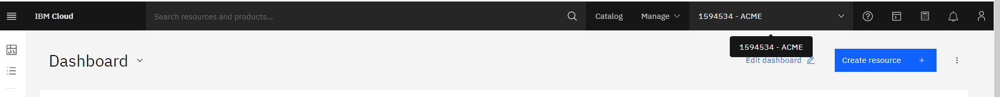

# IBM Cloud Setup

---

### PLEASE READ CAREFULLY!

Don't just copy/paste every command without reading

---

> **Note for Windows Users:** You'll run all of these commands from Ubuntu (WSL)

## Install the `ibmcloud` CLI

Do you already have `ibmcloud` installed?

```bash
which ibmcloud
```

If you see output like `/usr/local/bin/ibmcloud` then you have successfully installed it.

If you see output like `not found` then you need to install it:

1. Visit https://cloud.ibm.com/docs/cli?topic=cli-install-ibmcloud-cli
1. Follow the instructions for your operating system.
   > Tip: You can use the shell script in the second section instead of the installer option.

## Install the `ibmcloud` container plugin

Do you have the container plugin?

```bash
ibmcloud plugin list
```

You should see `container-service` in the list of plugins.

If you do not see `container-service` then do the following:

```
ibmcloud plugin install container-service
```

> NOTE: if that still doesn't work, go to [this page](https://cloud.ibm.com/docs/containers?topic=containers-cs_cli_install) and follow the instructions.


## [Access ACME account](#access-acme-account)
---

**NOTE: If you are installing tools before class starts, the cluster below might not be created yet, so SKIP THESE STEPS**

---

### Access the OpenShift Cluster

In order to login to the cluster from the command line, you must first log in on the website.

1. Log into https://cloud.ibm.com with your IBM email address
1. Make sure that "ACME" is selected from the account menu
1. Under "Resource Summary" click "Clusters"
1. Click "OpenShift Web Console"
1. You should see the OpenShift web console




### Install the `oc` CLI

When you have access to your Openshift cluster, please install the `oc` command line using the web console (follow the instructions for your operating system):

https://docs.openshift.com/container-platform/4.8/cli_reference/openshift_cli/getting-started-cli.html#cli-installing-cli-web-console_cli-developer-commands


### [Get an API Key](#access-ibm-cloud-api-key)
1. Log into https://cloud.ibm.com with your IBM email address
1. ‼️ Make sure that "ACME" is selected from the account menu (see below)
1. Click on Manage > Access (IAM)
1. Under "My IBM Cloud API keys" click "View all" or click on the left menu "API Keys"
1. Click "Create an IBM Cloud API key"
1. Enter a name and create the key
1. Download the key to your computer (if you don't, you'll have to create another one)
 


### Login to `ibmcloud`

In order to test that your account works, login using your API key.

Replace `YOUR_API_KEY` with your actual API key and then run this command:

```bash
ibmcloud login --apikey YOUR_API_KEY -r us-south
```

Run `ibmcloud ks clusters` to see the list of clusters you can access.

> NOTE: if you are following these instructions before class starts, the cluster list might be empty, and that's OK.

You should see your cohort's cluster in the list.

If you don't, it could be because:

1. It's before class started, and we haven't created it yet
1. You created your API key in the wrong account (your personal account, as opposed to ITZ-V2)
1. You have not been granted access to the cluster - contact your instructor

> NOTE: There is a Cloud-Native Toolkit: https://cloudnativetoolkit.dev/learning/dev-setup/ but we are not using it here because we want you to install only what is needed for the bootcamp
